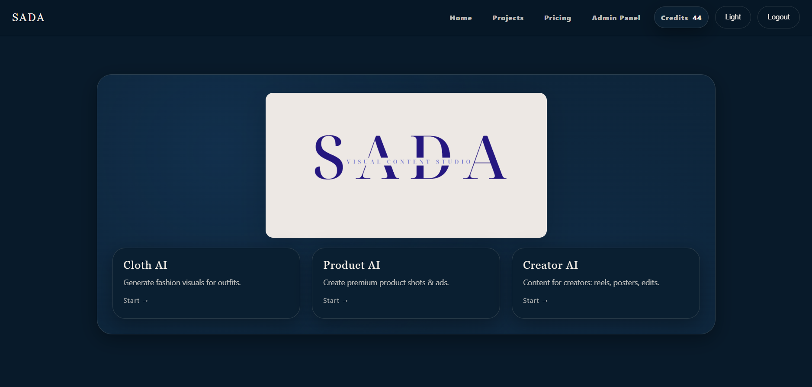
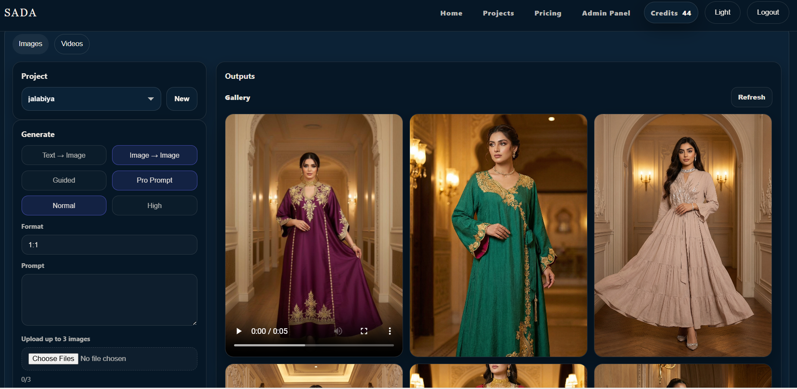

# 🤖 SADA AI 

## 🎨 Home page of the Platform

---

## 🧠 App Name
**SADA AI**

An AI-powered SaaS web platform for generating images and videos using advanced AI models, with a secure credit-based system and real-time generation tracking.

---

## 📝 Description
SADA AI is a full-stack AI content generation platform that allows users to:

- Generate AI images and videos using prompts and presets
- Choose styles, ratios, and generation options
- Track generation progress in real time
- Manage credits through subscriptions and packs
- View generated outputs in a personal gallery
- Manage their account and usage history

The platform is designed as a **production-ready SaaS system**, focusing on scalability, security, cost control, and user experience.

---

## 🚀 Getting Started

### 📋 Planning Materials
- ERD
- System Architecture Diagram
- User Roles & Permissions
- Generation Flow (Async + Webhooks)

## 🧩 Features
- JWT-based authentication (access & refresh tokens)
- Role-based access (user / admin)
- AI image and video generation
- Asynchronous generation jobs
- Credit-based usage system
- Ledger system for credit auditing
- Real-time status updates using SSE
- Secure webhook handling from AI providers
- Admin panel for managing plans, prompts, and pricing
- Responsive modern UI

---

## 🛠️ Technologies Used

### Front-End
- React
- React Router
- Axios
- Context API
- CSS Modules

### Back-End
- Node.js
- Express
- MongoDB
- Mongoose
- JWT Authentication
- Server-Sent Events (SSE)
- Webhooks
- ngrok (development)

---

## 🔐 Security & Architecture Highlights
- Token-based authentication with JWT and jti
- Credit ledger for accurate usage tracking
- One active generation per user to prevent abuse
- Asynchronous job processing for scalability
- Webhook-based result delivery
- Event-based architecture ready for horizontal scaling
- Prepared for WAF and rate limiting in production

---

## 📚 Attributions
- AI generation provider APIs used for image and video generation
- Icons and assets used for demo purposes
- ngrok for local webhook testing during development

---

## 🔮 Next Steps (Future Enhancements)
- Production deployment with WAF/CDN
- Advanced rate limiting and bot protection
- Payment gateway integration
- Usage analytics dashboard
- Team & enterprise accounts
- Mobile application support
